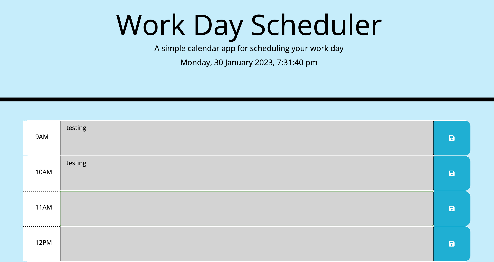
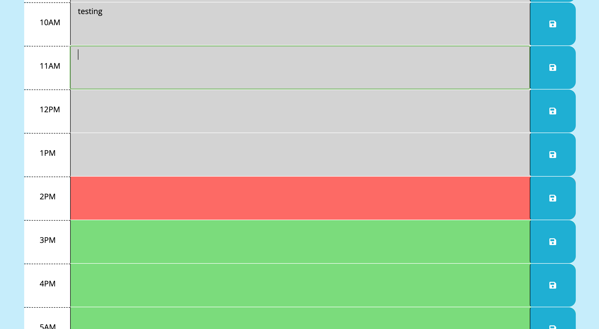
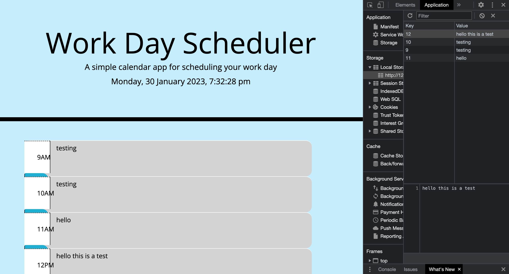

# work-diary
This repo contains the code for the week 7 project which is creating a work day diary using HTML and CSS powered by jQuery.

## Description

In this challenge i had to use Javascript to create a work day diary that had the hours of the working day and a text area that the user could input what they needed to do on an hourly basis. The user should then be able to save the event and have it viewable even when the page is refreshed. This is done by displaying the value from the local storage.

The text area should also have a background colour that changes depending if the task is in the past, the present or the future.

To begin I added a JS file and started added in code. I first started with making sure the save button had an event listener. When clicked it would display my 'saved notification'. It would also take the timeId and value from the description box and save them to the local storage.

I then added my date and time element and made it so that it live updated each second.

i then created the hourstatus function that would check the current time and see if the text area for each section ID was in the past/present/future. i done this by creating a forloop that would loop through the sections and look at the number value from the ID. if this number was less than,equal to or more than the current hour, then the background colour would change accordingly.

Finally i targeted the description from each ID and get the value of the tetarea to match the value saved within the local storage that had the same key as the numerical value of the IDs.

For the purpose of the screenshots i changed the value of the current hour so that i could show the different colours of the textarea boxes. For this i set the current time to be equal to "14" (14:00pm)

## Table of Contents

- [Installation](#installation)
- [Screenshots](#screenshots)
- [License](#license)

## Installation

No need to install anything to view this project; you can view it [here]()

## Screenshots

## License

MIT licence

---

© 2022 edX Boot Camps LLC. Confidential and Proprietary. All Rights Reserved.

